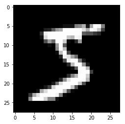
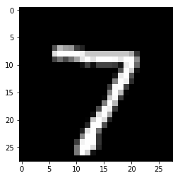

```python
#This is a sample Keras code to predict MNIST Digits using simple Multi-Layer Perceptron
```


```python
#Load the MNIST Dataset from Keras
from keras.datasets import mnist
```

    Using TensorFlow backend.


```python
(x_train,y_train),(x_test,y_test) = mnist.load_data()
```


```python
#show the dimensions of the loaded training and test data sets
x_train.shape
#x_train is an array of gray-scale images (28x28 pixels)
```


    (60000, 28, 28)


```python
y_train.shape
#y_train is an array of labels corresponding to the x_train images
```


    (60000,)


```python
x_test.shape
#x_test is an array of gray-scale images that will be used for testing
```


    (10000, 28, 28)


```python
y_test.shape
#y_test is an array of labels for testing
```


    (10000,)


```python
#display some sample images from the training and testing datasets
#show first image
%matplotlib inline
import matplotlib.pyplot as plt
img = x_train[0]
plt.imshow(img, cmap='gray')
```


    <matplotlib.image.AxesImage at 0x118dbd550>





```python
img = x_test[0]
plt.imshow(img, cmap='gray')
```


    <matplotlib.image.AxesImage at 0x118eab550>





```python
#show the corresponding labels
label = y_train[0]
print(label)
label = y_test[0]
print(label)
```

    5
    7


```python
dim = img.shape[0]
#flatten the images
flat_train = x_train.reshape([-1,dim*dim])
flat_test = x_test.reshape([-1,dim*dim])
print('flattened shape: ', flat_train.shape)
```

    flattened shape:  (60000, 784)


```python
#show sample values
flat_train[0]
```


    array([  0,   0,   0,   0,   0,   0,   0,   0,   0,   0,   0,   0,   0,
             0,   0,   0,   0,   0,   0,   0,   0,   0,   0,   0,   0,   0,
             0,   0,   0,   0,   0,   0,   0,   0,   0,   0,   0,   0,   0,
             0,   0,   0,   0,   0,   0,   0,   0,   0,   0,   0,   0,   0,
             0,   0,   0,   0,   0,   0,   0,   0,   0,   0,   0,   0,   0,
             0,   0,   0,   0,   0,   0,   0,   0,   0,   0,   0,   0,   0,
             0,   0,   0,   0,   0,   0,   0,   0,   0,   0,   0,   0,   0,
             0,   0,   0,   0,   0,   0,   0,   0,   0,   0,   0,   0,   0,
             0,   0,   0,   0,   0,   0,   0,   0,   0,   0,   0,   0,   0,
             0,   0,   0,   0,   0,   0,   0,   0,   0,   0,   0,   0,   0,
             0,   0,   0,   0,   0,   0,   0,   0,   0,   0,   0,   0,   0,
             0,   0,   0,   0,   0,   0,   0,   0,   0,   3,  18,  18,  18,
           126, 136, 175,  26, 166, 255, 247, 127,   0,   0,   0,   0,   0,
             0,   0,   0,   0,   0,   0,   0,  30,  36,  94, 154, 170, 253,
           253, 253, 253, 253, 225, 172, 253, 242, 195,  64,   0,   0,   0,
             0,   0,   0,   0,   0,   0,   0,   0,  49, 238, 253, 253, 253,
           253, 253, 253, 253, 253, 251,  93,  82,  82,  56,  39,   0,   0,
             0,   0,   0,   0,   0,   0,   0,   0,   0,   0,  18, 219, 253,
           253, 253, 253, 253, 198, 182, 247, 241,   0,   0,   0,   0,   0,
             0,   0,   0,   0,   0,   0,   0,   0,   0,   0,   0,   0,   0,
            80, 156, 107, 253, 253, 205,  11,   0,  43, 154,   0,   0,   0,
             0,   0,   0,   0,   0,   0,   0,   0,   0,   0,   0,   0,   0,
             0,   0,   0,  14,   1, 154, 253,  90,   0,   0,   0,   0,   0,
             0,   0,   0,   0,   0,   0,   0,   0,   0,   0,   0,   0,   0,
             0,   0,   0,   0,   0,   0,   0, 139, 253, 190,   2,   0,   0,
             0,   0,   0,   0,   0,   0,   0,   0,   0,   0,   0,   0,   0,
             0,   0,   0,   0,   0,   0,   0,   0,   0,  11, 190, 253,  70,
             0,   0,   0,   0,   0,   0,   0,   0,   0,   0,   0,   0,   0,
             0,   0,   0,   0,   0,   0,   0,   0,   0,   0,   0,   0,  35,
           241, 225, 160, 108,   1,   0,   0,   0,   0,   0,   0,   0,   0,
             0,   0,   0,   0,   0,   0,   0,   0,   0,   0,   0,   0,   0,
             0,   0,  81, 240, 253, 253, 119,  25,   0,   0,   0,   0,   0,
             0,   0,   0,   0,   0,   0,   0,   0,   0,   0,   0,   0,   0,
             0,   0,   0,   0,   0,  45, 186, 253, 253, 150,  27,   0,   0,
             0,   0,   0,   0,   0,   0,   0,   0,   0,   0,   0,   0,   0,
             0,   0,   0,   0,   0,   0,   0,   0,  16,  93, 252, 253, 187,
             0,   0,   0,   0,   0,   0,   0,   0,   0,   0,   0,   0,   0,
             0,   0,   0,   0,   0,   0,   0,   0,   0,   0,   0,   0, 249,
           253, 249,  64,   0,   0,   0,   0,   0,   0,   0,   0,   0,   0,
             0,   0,   0,   0,   0,   0,   0,   0,   0,   0,   0,  46, 130,
           183, 253, 253, 207,   2,   0,   0,   0,   0,   0,   0,   0,   0,
             0,   0,   0,   0,   0,   0,   0,   0,   0,   0,   0,  39, 148,
           229, 253, 253, 253, 250, 182,   0,   0,   0,   0,   0,   0,   0,
             0,   0,   0,   0,   0,   0,   0,   0,   0,   0,   0,  24, 114,
           221, 253, 253, 253, 253, 201,  78,   0,   0,   0,   0,   0,   0,
             0,   0,   0,   0,   0,   0,   0,   0,   0,   0,   0,  23,  66,
           213, 253, 253, 253, 253, 198,  81,   2,   0,   0,   0,   0,   0,
             0,   0,   0,   0,   0,   0,   0,   0,   0,   0,   0,  18, 171,
           219, 253, 253, 253, 253, 195,  80,   9,   0,   0,   0,   0,   0,
             0,   0,   0,   0,   0,   0,   0,   0,   0,   0,   0,  55, 172,
           226, 253, 253, 253, 253, 244, 133,  11,   0,   0,   0,   0,   0,
             0,   0,   0,   0,   0,   0,   0,   0,   0,   0,   0,   0,   0,
           136, 253, 253, 253, 212, 135, 132,  16,   0,   0,   0,   0,   0,
             0,   0,   0,   0,   0,   0,   0,   0,   0,   0,   0,   0,   0,
             0,   0,   0,   0,   0,   0,   0,   0,   0,   0,   0,   0,   0,
             0,   0,   0,   0,   0,   0,   0,   0,   0,   0,   0,   0,   0,
             0,   0,   0,   0,   0,   0,   0,   0,   0,   0,   0,   0,   0,
             0,   0,   0,   0,   0,   0,   0,   0,   0,   0,   0,   0,   0,
             0,   0,   0,   0,   0,   0,   0,   0,   0,   0,   0,   0,   0,
             0,   0,   0,   0,   0,   0,   0,   0,   0,   0,   0,   0,   0,
             0,   0,   0,   0], dtype=uint8)


```python
#normalize the values
norm_train = flat_train.astype('float32')/255
norm_test = flat_test.astype('float32')/255
```


```python
#show sample normalized values
norm_train[0]
```


    array([ 0.        ,  0.        ,  0.        ,  0.        ,  0.        ,
            0.        ,  0.        ,  0.        ,  0.        ,  0.        ,
            0.        ,  0.        ,  0.        ,  0.        ,  0.        ,
            0.        ,  0.        ,  0.        ,  0.        ,  0.        ,
            0.        ,  0.        ,  0.        ,  0.        ,  0.        ,
            0.        ,  0.        ,  0.        ,  0.        ,  0.        ,
            0.        ,  0.        ,  0.        ,  0.        ,  0.        ,
            0.        ,  0.        ,  0.        ,  0.        ,  0.        ,
            0.        ,  0.        ,  0.        ,  0.        ,  0.        ,
            0.        ,  0.        ,  0.        ,  0.        ,  0.        ,
            0.        ,  0.        ,  0.        ,  0.        ,  0.        ,
            0.        ,  0.        ,  0.        ,  0.        ,  0.        ,
            0.        ,  0.        ,  0.        ,  0.        ,  0.        ,
            0.        ,  0.        ,  0.        ,  0.        ,  0.        ,
            0.        ,  0.        ,  0.        ,  0.        ,  0.        ,
            0.        ,  0.        ,  0.        ,  0.        ,  0.        ,
            0.        ,  0.        ,  0.        ,  0.        ,  0.        ,
            0.        ,  0.        ,  0.        ,  0.        ,  0.        ,
            0.        ,  0.        ,  0.        ,  0.        ,  0.        ,
            0.        ,  0.        ,  0.        ,  0.        ,  0.        ,
            0.        ,  0.        ,  0.        ,  0.        ,  0.        ,
            0.        ,  0.        ,  0.        ,  0.        ,  0.        ,
            0.        ,  0.        ,  0.        ,  0.        ,  0.        ,
            0.        ,  0.        ,  0.        ,  0.        ,  0.        ,
            0.        ,  0.        ,  0.        ,  0.        ,  0.        ,
            0.        ,  0.        ,  0.        ,  0.        ,  0.        ,
            0.        ,  0.        ,  0.        ,  0.        ,  0.        ,
            0.        ,  0.        ,  0.        ,  0.        ,  0.        ,
            0.        ,  0.        ,  0.        ,  0.        ,  0.        ,
            0.        ,  0.        ,  0.        ,  0.        ,  0.        ,
            0.        ,  0.        ,  0.01176471,  0.07058824,  0.07058824,
            0.07058824,  0.49411765,  0.53333336,  0.68627453,  0.10196079,
            0.65098041,  1.        ,  0.96862745,  0.49803922,  0.        ,
            0.        ,  0.        ,  0.        ,  0.        ,  0.        ,
            0.        ,  0.        ,  0.        ,  0.        ,  0.        ,
            0.        ,  0.11764706,  0.14117648,  0.36862746,  0.60392159,
            0.66666669,  0.99215686,  0.99215686,  0.99215686,  0.99215686,
            0.99215686,  0.88235295,  0.67450982,  0.99215686,  0.94901961,
            0.7647059 ,  0.25098041,  0.        ,  0.        ,  0.        ,
            0.        ,  0.        ,  0.        ,  0.        ,  0.        ,
            0.        ,  0.        ,  0.        ,  0.19215687,  0.93333334,
            0.99215686,  0.99215686,  0.99215686,  0.99215686,  0.99215686,
            0.99215686,  0.99215686,  0.99215686,  0.98431373,  0.36470589,
            0.32156864,  0.32156864,  0.21960784,  0.15294118,  0.        ,
            0.        ,  0.        ,  0.        ,  0.        ,  0.        ,
            0.        ,  0.        ,  0.        ,  0.        ,  0.        ,
            0.        ,  0.07058824,  0.85882354,  0.99215686,  0.99215686,
            0.99215686,  0.99215686,  0.99215686,  0.7764706 ,  0.71372551,
            0.96862745,  0.94509804,  0.        ,  0.        ,  0.        ,
            0.        ,  0.        ,  0.        ,  0.        ,  0.        ,
            0.        ,  0.        ,  0.        ,  0.        ,  0.        ,
            0.        ,  0.        ,  0.        ,  0.        ,  0.        ,
            0.3137255 ,  0.61176473,  0.41960785,  0.99215686,  0.99215686,
            0.80392158,  0.04313726,  0.        ,  0.16862746,  0.60392159,
            0.        ,  0.        ,  0.        ,  0.        ,  0.        ,
            0.        ,  0.        ,  0.        ,  0.        ,  0.        ,
            0.        ,  0.        ,  0.        ,  0.        ,  0.        ,
            0.        ,  0.        ,  0.        ,  0.        ,  0.05490196,
            0.00392157,  0.60392159,  0.99215686,  0.35294119,  0.        ,
            0.        ,  0.        ,  0.        ,  0.        ,  0.        ,
            0.        ,  0.        ,  0.        ,  0.        ,  0.        ,
            0.        ,  0.        ,  0.        ,  0.        ,  0.        ,
            0.        ,  0.        ,  0.        ,  0.        ,  0.        ,
            0.        ,  0.        ,  0.        ,  0.        ,  0.54509807,
            0.99215686,  0.74509805,  0.00784314,  0.        ,  0.        ,
            0.        ,  0.        ,  0.        ,  0.        ,  0.        ,
            0.        ,  0.        ,  0.        ,  0.        ,  0.        ,
            0.        ,  0.        ,  0.        ,  0.        ,  0.        ,
            0.        ,  0.        ,  0.        ,  0.        ,  0.        ,
            0.        ,  0.        ,  0.04313726,  0.74509805,  0.99215686,
            0.27450982,  0.        ,  0.        ,  0.        ,  0.        ,
            0.        ,  0.        ,  0.        ,  0.        ,  0.        ,
            0.        ,  0.        ,  0.        ,  0.        ,  0.        ,
            0.        ,  0.        ,  0.        ,  0.        ,  0.        ,
            0.        ,  0.        ,  0.        ,  0.        ,  0.        ,
            0.        ,  0.13725491,  0.94509804,  0.88235295,  0.627451  ,
            0.42352942,  0.00392157,  0.        ,  0.        ,  0.        ,
            0.        ,  0.        ,  0.        ,  0.        ,  0.        ,
            0.        ,  0.        ,  0.        ,  0.        ,  0.        ,
            0.        ,  0.        ,  0.        ,  0.        ,  0.        ,
            0.        ,  0.        ,  0.        ,  0.        ,  0.        ,
            0.31764707,  0.94117647,  0.99215686,  0.99215686,  0.46666667,
            0.09803922,  0.        ,  0.        ,  0.        ,  0.        ,
            0.        ,  0.        ,  0.        ,  0.        ,  0.        ,
            0.        ,  0.        ,  0.        ,  0.        ,  0.        ,
            0.        ,  0.        ,  0.        ,  0.        ,  0.        ,
            0.        ,  0.        ,  0.        ,  0.        ,  0.17647059,
            0.72941178,  0.99215686,  0.99215686,  0.58823532,  0.10588235,
            0.        ,  0.        ,  0.        ,  0.        ,  0.        ,
            0.        ,  0.        ,  0.        ,  0.        ,  0.        ,
            0.        ,  0.        ,  0.        ,  0.        ,  0.        ,
            0.        ,  0.        ,  0.        ,  0.        ,  0.        ,
            0.        ,  0.        ,  0.        ,  0.0627451 ,  0.36470589,
            0.98823529,  0.99215686,  0.73333335,  0.        ,  0.        ,
            0.        ,  0.        ,  0.        ,  0.        ,  0.        ,
            0.        ,  0.        ,  0.        ,  0.        ,  0.        ,
            0.        ,  0.        ,  0.        ,  0.        ,  0.        ,
            0.        ,  0.        ,  0.        ,  0.        ,  0.        ,
            0.        ,  0.        ,  0.        ,  0.97647059,  0.99215686,
            0.97647059,  0.25098041,  0.        ,  0.        ,  0.        ,
            0.        ,  0.        ,  0.        ,  0.        ,  0.        ,
            0.        ,  0.        ,  0.        ,  0.        ,  0.        ,
            0.        ,  0.        ,  0.        ,  0.        ,  0.        ,
            0.        ,  0.        ,  0.        ,  0.18039216,  0.50980395,
            0.71764708,  0.99215686,  0.99215686,  0.81176472,  0.00784314,
            0.        ,  0.        ,  0.        ,  0.        ,  0.        ,
            0.        ,  0.        ,  0.        ,  0.        ,  0.        ,
            0.        ,  0.        ,  0.        ,  0.        ,  0.        ,
            0.        ,  0.        ,  0.        ,  0.        ,  0.15294118,
            0.58039218,  0.89803922,  0.99215686,  0.99215686,  0.99215686,
            0.98039216,  0.71372551,  0.        ,  0.        ,  0.        ,
            0.        ,  0.        ,  0.        ,  0.        ,  0.        ,
            0.        ,  0.        ,  0.        ,  0.        ,  0.        ,
            0.        ,  0.        ,  0.        ,  0.        ,  0.        ,
            0.09411765,  0.44705883,  0.86666667,  0.99215686,  0.99215686,
            0.99215686,  0.99215686,  0.78823531,  0.30588236,  0.        ,
            0.        ,  0.        ,  0.        ,  0.        ,  0.        ,
            0.        ,  0.        ,  0.        ,  0.        ,  0.        ,
            0.        ,  0.        ,  0.        ,  0.        ,  0.        ,
            0.        ,  0.09019608,  0.25882354,  0.83529413,  0.99215686,
            0.99215686,  0.99215686,  0.99215686,  0.7764706 ,  0.31764707,
            0.00784314,  0.        ,  0.        ,  0.        ,  0.        ,
            0.        ,  0.        ,  0.        ,  0.        ,  0.        ,
            0.        ,  0.        ,  0.        ,  0.        ,  0.        ,
            0.        ,  0.        ,  0.07058824,  0.67058825,  0.85882354,
            0.99215686,  0.99215686,  0.99215686,  0.99215686,  0.7647059 ,
            0.3137255 ,  0.03529412,  0.        ,  0.        ,  0.        ,
            0.        ,  0.        ,  0.        ,  0.        ,  0.        ,
            0.        ,  0.        ,  0.        ,  0.        ,  0.        ,
            0.        ,  0.        ,  0.        ,  0.21568628,  0.67450982,
            0.88627452,  0.99215686,  0.99215686,  0.99215686,  0.99215686,
            0.95686275,  0.52156866,  0.04313726,  0.        ,  0.        ,
            0.        ,  0.        ,  0.        ,  0.        ,  0.        ,
            0.        ,  0.        ,  0.        ,  0.        ,  0.        ,
            0.        ,  0.        ,  0.        ,  0.        ,  0.        ,
            0.        ,  0.53333336,  0.99215686,  0.99215686,  0.99215686,
            0.83137256,  0.52941179,  0.51764709,  0.0627451 ,  0.        ,
            0.        ,  0.        ,  0.        ,  0.        ,  0.        ,
            0.        ,  0.        ,  0.        ,  0.        ,  0.        ,
            0.        ,  0.        ,  0.        ,  0.        ,  0.        ,
            0.        ,  0.        ,  0.        ,  0.        ,  0.        ,
            0.        ,  0.        ,  0.        ,  0.        ,  0.        ,
            0.        ,  0.        ,  0.        ,  0.        ,  0.        ,
            0.        ,  0.        ,  0.        ,  0.        ,  0.        ,
            0.        ,  0.        ,  0.        ,  0.        ,  0.        ,
            0.        ,  0.        ,  0.        ,  0.        ,  0.        ,
            0.        ,  0.        ,  0.        ,  0.        ,  0.        ,
            0.        ,  0.        ,  0.        ,  0.        ,  0.        ,
            0.        ,  0.        ,  0.        ,  0.        ,  0.        ,
            0.        ,  0.        ,  0.        ,  0.        ,  0.        ,
            0.        ,  0.        ,  0.        ,  0.        ,  0.        ,
            0.        ,  0.        ,  0.        ,  0.        ,  0.        ,
            0.        ,  0.        ,  0.        ,  0.        ,  0.        ,
            0.        ,  0.        ,  0.        ,  0.        ,  0.        ,
            0.        ,  0.        ,  0.        ,  0.        ,  0.        ,
            0.        ,  0.        ,  0.        ,  0.        ,  0.        ,
            0.        ,  0.        ,  0.        ,  0.        ], dtype=float32)


```python
#transform labels as categorical values
from keras.utils import to_categorical
train_labels = to_categorical(y_train)
test_labels = to_categorical(y_test)
print('label shape: ', train_labels.shape)
```

    label shape:  (60000, 10)


```python
#set configurable parameters
input_size = norm_train.shape[1]
num_labels = train_labels.shape[1]
batch_size = 128
hidden_units = 256
dropout = 0.45
```


```python
from keras.models import Sequential
from keras.layers import Dense, Activation, Dropout

model = Sequential()
model.add(Dense(hidden_units, input_dim=input_size))
model.add(Activation('relu'))
model.add(Dropout(dropout))
model.add(Dense(hidden_units))
model.add(Activation('relu'))
model.add(Dropout(dropout))
model.add(Dense(num_labels))
model.add(Activation('softmax'))
model.summary()
```

    _________________________________________________________________
    Layer (type)                 Output Shape              Param #   
    =================================================================
    dense_3 (Dense)              (None, 256)               200960    
    _________________________________________________________________
    activation_3 (Activation)    (None, 256)               0         
    _________________________________________________________________
    dropout_3 (Dropout)          (None, 256)               0         
    _________________________________________________________________
    dense_4 (Dense)              (None, 256)               65792     
    _________________________________________________________________
    activation_4 (Activation)    (None, 256)               0         
    _________________________________________________________________
    dropout_4 (Dropout)          (None, 256)               0         
    _________________________________________________________________
    dense_5 (Dense)              (None, 10)                2570      
    _________________________________________________________________
    activation_5 (Activation)    (None, 10)                0         
    =================================================================
    Total params: 269,322
    Trainable params: 269,322
    Non-trainable params: 0
    _________________________________________________________________


```python
#compile our model
model.compile(loss='categorical_crossentropy', optimizer='adam',
              metrics=['accuracy'])
```


```python
#train our model
model.fit(norm_train, train_labels, epochs=20, batch_size=batch_size)
```

    Epoch 1/20
    60000/60000 [==============================] - 8s 136us/step - loss: 0.4303 - acc: 0.8659
    Epoch 2/20
    60000/60000 [==============================] - 8s 133us/step - loss: 0.2007 - acc: 0.9402
    Epoch 3/20
    60000/60000 [==============================] - 8s 133us/step - loss: 0.1536 - acc: 0.9541
    Epoch 4/20
    60000/60000 [==============================] - 8s 128us/step - loss: 0.1300 - acc: 0.9610
    Epoch 5/20
    60000/60000 [==============================] - 7s 121us/step - loss: 0.1153 - acc: 0.9652
    Epoch 6/20
    60000/60000 [==============================] - 7s 120us/step - loss: 0.1027 - acc: 0.9692
    Epoch 7/20
    60000/60000 [==============================] - 7s 120us/step - loss: 0.0958 - acc: 0.9708
    Epoch 8/20
    60000/60000 [==============================] - 7s 120us/step - loss: 0.0886 - acc: 0.9724
    Epoch 9/20
    60000/60000 [==============================] - 7s 120us/step - loss: 0.0831 - acc: 0.9744
    Epoch 10/20
    60000/60000 [==============================] - 7s 120us/step - loss: 0.0765 - acc: 0.9763
    Epoch 11/20
    60000/60000 [==============================] - 7s 121us/step - loss: 0.0736 - acc: 0.9763
    Epoch 12/20
    60000/60000 [==============================] - 8s 141us/step - loss: 0.0709 - acc: 0.9780
    Epoch 13/20
    60000/60000 [==============================] - 8s 137us/step - loss: 0.0664 - acc: 0.9788
    Epoch 14/20
    60000/60000 [==============================] - 8s 138us/step - loss: 0.0638 - acc: 0.9793
    Epoch 15/20
    60000/60000 [==============================] - 8s 137us/step - loss: 0.0644 - acc: 0.9793
    Epoch 16/20
    60000/60000 [==============================] - 8s 138us/step - loss: 0.0579 - acc: 0.9809
    Epoch 17/20
    60000/60000 [==============================] - 8s 140us/step - loss: 0.0593 - acc: 0.9812
    Epoch 18/20
    60000/60000 [==============================] - 8s 139us/step - loss: 0.0550 - acc: 0.9814
    Epoch 19/20
    60000/60000 [==============================] - 8s 138us/step - loss: 0.0550 - acc: 0.9824
    Epoch 20/20
    60000/60000 [==============================] - 8s 139us/step - loss: 0.0566 - acc: 0.9818


    <keras.callbacks.History at 0x126ce9b00>


```python
score = model.evaluate(norm_test, test_labels, batch_size=batch_size)
```

    10000/10000 [==============================] - 0s 45us/step


```python
score
```


    [0.058491837208101062, 0.98309999999999997]


```python
sample = norm_train[0]
sample = sample.reshape([1,-1])
```


```python
num = model.predict(sample)
```


```python
num
```


    array([[  1.70953655e-21,   7.53669376e-16,   6.53810571e-17,
              3.69392546e-05,   8.36950003e-20,   9.99962926e-01,
              6.04128879e-19,   7.87650975e-17,   1.46094193e-14,
              1.53700356e-07]], dtype=float32)


```python
num.argmax()
```


    5


```python
sample = norm_test[0].reshape([1,-1])
num = model.predict(sample)
print("probability: ", num)
print("prediction: ", num.argmax())
```

    probability:  [[  1.49344201e-13   1.42855963e-10   1.17309973e-09   1.21340813e-08
        2.70941496e-14   1.09324581e-11   6.53023732e-19   9.99999523e-01
        4.81604201e-11   4.57720859e-07]]
    prediction:  7

